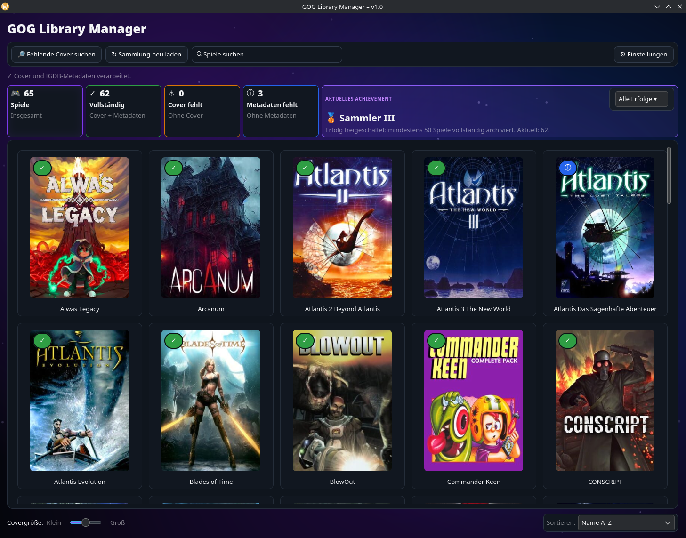

# GOG Library Manager 1.1

A native **GTK4 / Wayland** desktop application for browsing a local GOG game collection, managing cover artwork, and enriching the library with optional **IGDB metadata**.

Version **1.1** expands Linux distribution support while keeping the v1.0 feature set.

## Highlights

- Displays the complete local GOG library as a cover grid
- Automatic and manual cover search through IGDB
- Replaces individual covers
- Stores covers centrally outside the game folders
- IGDB metadata including release date, genres, platforms, ratings, developers, publishers and descriptions
- Manual IGDB matching for ambiguous game names
- Search, filters and sorting
- Collection statistics and achievements
- Adjustable cover sizes
- German and English interface
- System, light and dark appearance settings
- Animated dark **Nebula / Aurora** background with subtle particles
- Double-click a game to open its game folder
- Native GTK4 interface designed for Linux and Wayland

## Screenshot

A screenshot is intentionally not included in the repository template yet.  
For GitHub, add one as `docs/screenshot.png` and replace this section with:





## Linux support

GOG Library Manager is a GTK4 application. Version 1.1 adds installation instructions and helper scripts for several Linux distribution families.

Supported installation paths:

- **Arch Linux** and Arch-based distributions such as Manjaro, EndeavourOS and CachyOS
- **Debian / Ubuntu** and Debian-based distributions such as Linux Mint and Pop!_OS
- **Fedora**
- **openSUSE** with manual installation instructions

The launcher no longer forces Wayland. GTK can automatically use **Wayland or X11** according to the active desktop session.
>>>>>>> 42bc8dc (Release 1.1 - add multi-distribution Linux support)

## Requirements

- Python 3
- GTK 4
- PyGObject
- GdkPixbuf 2
- PyCairo
- Pillow
- requests

System packages are recommended for GTK/PyGObject.

## Installation

Clone the repository:

```bash
git clone https://github.com/Wummhelm/GOG-Library-Manager_1.0.git
cd GOG-Library-Manager_1.0
chmod +x GOG-Library-Manager.sh install-*.sh
```

### Automatic installer

On Arch-based, Debian/Ubuntu-based and Fedora systems:

```bash
./install-linux.sh
./GOG-Library-Manager.sh
```

### Arch Linux / Manjaro / EndeavourOS / CachyOS

```bash
./install-arch.sh
./GOG-Library-Manager.sh
```

Manual command:

```bash
sudo pacman -S --needed python gtk4 python-gobject python-cairo python-pillow python-requests
```

### Debian / Ubuntu / Linux Mint / Pop!_OS

```bash
./install-debian-ubuntu.sh
./GOG-Library-Manager.sh
```

Manual command:

```bash
sudo apt update
sudo apt install -y python3 python3-gi python3-gi-cairo gir1.2-gtk-4.0 python3-pil python3-requests
```

### Fedora

```bash
./install-fedora.sh
./GOG-Library-Manager.sh
```

Manual command:

```bash
sudo dnf install -y python3 python3-gobject gtk4 python3-cairo python3-pillow python3-requests
```

### openSUSE

Install the GTK4/PyGObject runtime:

```bash
sudo zypper install python3-gobject python3-gobject-Gdk typelib-1_0-Gtk-4_0 libgtk-4-1
```

Pillow and Requests package names/availability can differ between openSUSE releases, so install the matching packages supplied by your release. On Tumbleweed, Pillow is available through the distribution package repositories.

Then run:

```bash
./GOG-Library-Manager.sh
```

### Check dependencies

```bash
python3 check_dependencies.py
```

## First start

On first launch, select the directory containing your locally installed or archived GOG games.

The application treats the direct subdirectories of that directory as individual games.

Example:

```text
/mnt/games/GOG/
├── Baldur's Gate/
├── Cyberpunk 2077/
└── The Witcher 3/
```

The selected path is stored locally and reused on later starts.

## IGDB setup

IGDB functionality is optional, but required for automatic cover downloads and metadata.

The application expects a **Twitch/IGDB Client ID and Client Secret**. Create application credentials in the Twitch Developer Console and enter them under **Settings** in GOG Library Manager.

Useful resources:

- Twitch Developer Console: https://dev.twitch.tv/console
- IGDB API documentation: https://api-docs.igdb.com/

Do **not** commit your personal credentials to this repository.

The application stores its configuration locally in:

```text
~/.config/gog-library-manager/config.json
```

The configuration file is created with restrictive file permissions where supported.

## Data locations

Configuration and IGDB cache:

```text
~/.config/gog-library-manager/
├── config.json
├── igdb_mappings.json
├── igdb_metadata.json
└── igdb_sync_state.json
```

Covers:

```text
~/.local/share/gog-library-manager/covers/<Game Name>/cover.jpg
```

The game directories themselves are therefore not used as the permanent cover storage location.

## Controls

- **Single left click:** no action
- **Double left click:** open the corresponding game folder
- **Right click:** replace the cover or show IGDB information
- **Search field:** filter the visible library by title
- **Filter controls:** show complete or incomplete entries
- **Sort menu:** sort by name, year, IGDB rating or completeness
- **Cover size slider:** change the cover grid size

## Wayland and X11

The launcher does not force a display backend. GTK automatically selects Wayland or X11 according to the current desktop session.

## Updating

Before replacing an older version, backing up the local configuration directory is optional but recommended:

```bash
cp -a ~/.config/gog-library-manager ~/.config/gog-library-manager.backup
```

The cover directory is separate:

```text
~/.local/share/gog-library-manager/covers/
```

## Privacy

GOG Library Manager works on your locally selected game directory.

When IGDB features are used, game-title searches and metadata requests are sent to Twitch/IGDB using the credentials configured by the user.

No analytics or telemetry are implemented by this project.

## Repository structure

```text
.
├── .github/
│   └── workflows/
│       └── syntax-check.yml
├── docs/
│   └── DEPENDENCIES.md
├── .gitignore
├── CHANGELOG.md
├── CONTRIBUTING.md
├── GOG-Library-Manager.sh
├── LICENSE
├── README.md
├── RELEASE_NOTES_1.0.md
├── SECURITY.md
├── VERSION
├── check_dependencies.py
├── gog_library_manager.py
├── install-arch.sh
└── requirements.txt
```

## Development check

A lightweight GitHub Actions workflow checks that the Python source compiles syntactically.

Locally:

```bash
python3 -m py_compile gog_library_manager.py
bash -n GOG-Library-Manager.sh
bash -n install-arch.sh
```

## Contributing

Bug reports and pull requests are welcome. See [CONTRIBUTING.md](CONTRIBUTING.md).

## License

Released under the [MIT License](LICENSE).

## Disclaimer

GOG Library Manager is an independent community project. It is not affiliated with, endorsed by, or sponsored by GOG, CD PROJEKT, Twitch, or IGDB.

GOG, IGDB, Twitch and other names or trademarks belong to their respective owners.
